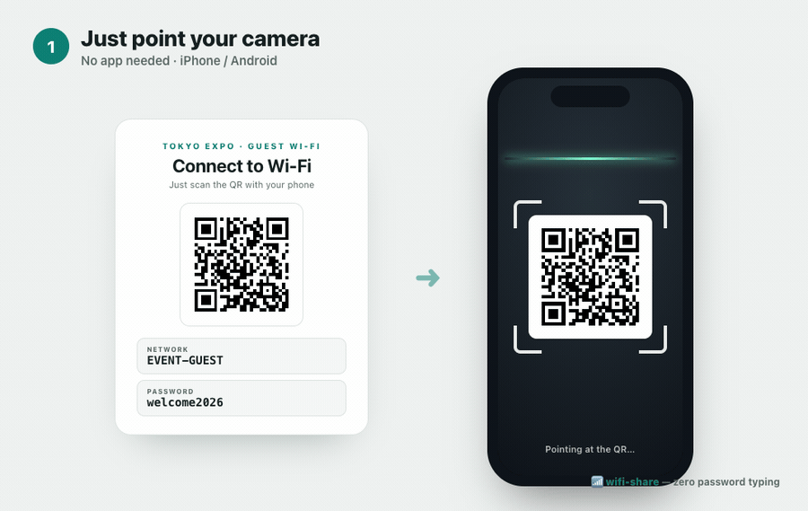
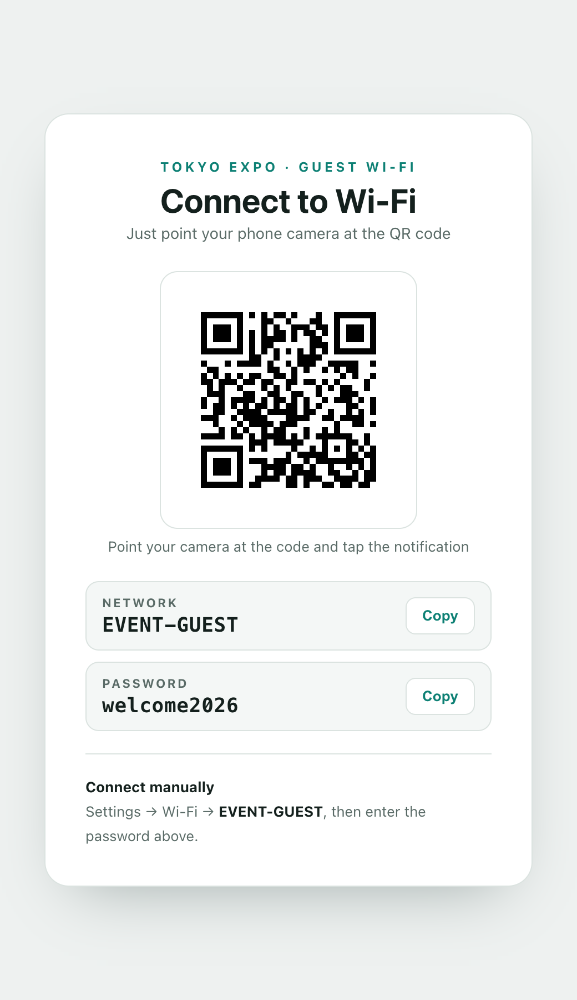
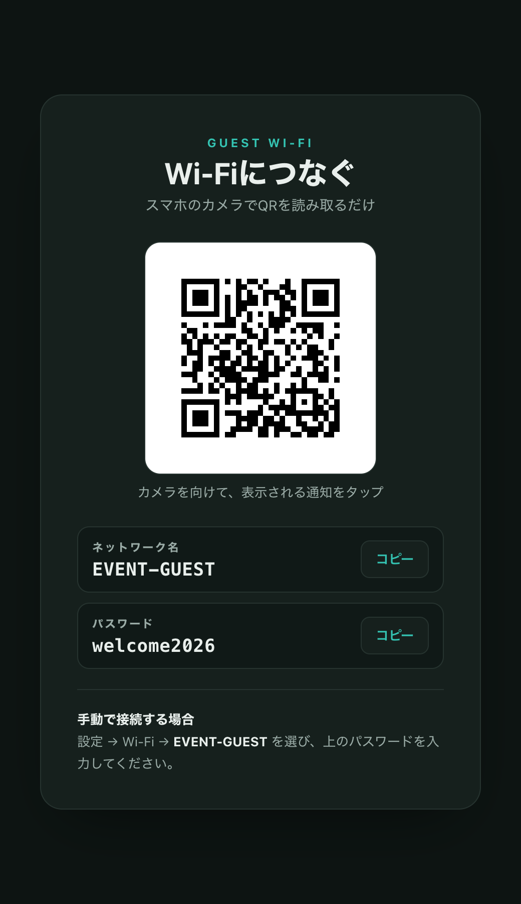
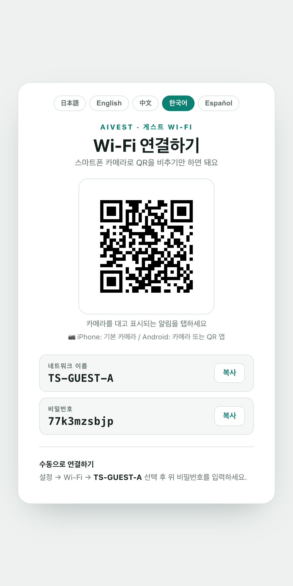

# 📶 wifi-share — hand your venue's Wi‑Fi to guests with a single scan

[日本語](README.md) | **English**

> No more repeating "the Wi‑Fi password is…" fifty times at the reception desk.
> Guests just point their camera — and they're online.

A Wi‑Fi sharing skill built by **Keita Takasuka — fermentation producer / event director** to solve a small friction he kept feeling on-site.
Give it a network name and password, and it **generates a connection QR poster → publishes a public URL (`https://xxxxxx.vercel.app`)** in one go.

<p align="center">
  
</p>
<p align="center"><sub>Point your camera → auto-detected → tap → connected (zero password typing)</sub></p>

<p align="center">
  
  &nbsp;&nbsp;
  
</p>

---

## 🎪 Sound familiar?

Anywhere people gather — events, conferences, pop-ups, shoots, coworking spaces — someone always asks: *"How do I get on the Wi‑Fi?"*

- Reception staff read out the password to every single guest
- A long string scrawled on a whiteboard gets mistyped — "it won't connect"
- Printed notices don't get read, or can't be found
- Speakers, exhibitors, and press each type the password into their phones

**A guest's very first impression starts with a fumbled password.** Small, but it drags down the whole experience.

---

## ✅ How it fixes that

For your guests, it's two steps:

1. **Point their phone camera** at the poster (or shared URL)
2. **Tap** the notification that appears → connected

Not a single character typed. It uses the standard **Wi‑Fi QR code** format supported natively on both iPhone and Android — no app required.

---

## ✨ Features

| | |
|---|---|
| 📷 **Scan to connect** | Native Wi‑Fi QR on iPhone/Android. One tap, no app |
| 🔗 **Shareable URL** | Publishes a public link — post it, message it, put it on a slide |
| 🖨️ **Print-ready** | Also outputs a standalone QR PNG. Stick it on the door |
| 🌐 **Language switcher** | 日本語 / English / 中文 / 한국어 / Español — guests tap to switch instantly |
| 🌗 **Auto light/dark** | Adapts to the venue screen or the guest's phone |
| ⌨️ **Manual fallback** | Copy buttons for network/password + manual steps included |
| 🛡️ **Built-in QR integrity check** | Self-verifies the generated QR to prevent "won't scan" on-site |

---

## 🚀 Usage (Claude Code skill)

This repo runs as a **skill** for [Claude Code](https://claude.com/claude-code).

### 1. Install

```bash
git clone https://github.com/tkaska-cell/wifi-share-skill.git
mkdir -p ~/.claude/skills
cp -R wifi-share-skill/skills/wifi-share ~/.claude/skills/
```

### 2. Invoke

In the Claude Code prompt:

```
/wifi-share TS-GUEST-A password123
```

Or paste the Wi‑Fi QR string you got from the venue:

```
/wifi-share WIFI:S:TS-GUEST-A;T:WPA;P:password123;;
```

Claude then handles **poster generation → render check → publish to Vercel → hands you the URL.**

> 💡 A Vercel account (free tier is fine) and a one-time `vercel login` are required.
> Prefer to stay offline? It can hand you just the local HTML / QR PNG instead.

---

## 🛠️ Without Claude Code (standalone script)

It's a plain Python script, so it works on its own too.

```bash
pip install "qrcode[pil]"

python3 skills/wifi-share/scripts/build_poster.py \
  --ssid "EVENT-GUEST" \
  --password "welcome2026" \
  --venue "Your Event" \
  --lang en \
  --outdir ./public \
  --qr-png ./public/wifi_qr.png \
  --project-dir .
```

You get `./public/index.html` (the poster) and `./public/wifi_qr.png` (print-ready QR).
Open `index.html` in a browser to use it immediately, or host it anywhere — Vercel / Netlify / Cloudflare / GitHub Pages.

---

## 🎨 Customize

- `--venue "Name"` … puts the venue / event name in the header
- `--langs ja,en,zh,ko,es` … languages shown in the switcher · `--lang ja` … initial language
- `--auth WPA|WEP|nopass` … security type (default `WPA`; use `nopass` for open networks)
- Edit the HTML template / `STRINGS` dict in `build_poster.py` to match your brand or add a language

<p align="center">
  
</p>
<p align="center"><sub>👆 Tap to switch 日本語 / English / 中文 / 한국어 / Español (shown: 한국어)</sub></p>

---

## 🔒 Security (built in by default)

Because a Wi‑Fi password ends up on a public URL, these safeguards ship on:

- **Kept out of search engines** — `noindex` meta + `X-Robots-Tag` header, so passwords aren't indexed by Google
- **Hard-to-guess URL** — a random suffix is added to the public URL
- **Security headers** — `nosniff` / `no-referrer` / `X-Frame-Options: DENY` (clickjacking protection)
- **Easy takedown** — remove it in one command after the event (`vercel remove <name>`); don't leave it up forever

### For the person using it

- Treat the password as **"guest" info meant to be posted/handed out at the venue**
- **Do not put your home/office everyday Wi‑Fi or internal network credentials on a public URL** — use the print PNG / local HTML only in that case
- A QR code *is* the password. Posting the QR image on social media = posting the password
- All screenshots in this README use dummy credentials

---

## 🌾 About the author

**Keita Takasuka** — fermentation producer / event director / CXO at AIVEST

At the AI marketing company **AIVEST**, I serve as **CXO (Chief Experience Officer)**, focused on maximizing customer experience. Removing small frictions to make an experience feel effortless — exactly like this skill — is a consistent theme in my work.

I also work to spread Japan's **fermentation culture** — rooted in our tables for over a thousand years — in a way that feels alive and fun again.
Its home base is **FERMENT U, a specialty shop for rice *koji***. While making living ferments — koji, amazake, fermented herb salt — part of everyday life, I also produce fermentation events across Japan (our 2025 Fermentation EXPO drew 2,000+ visitors).

This skill was born from that world: from repeating "here's the Wi‑Fi" more times than I can count, and wanting to do it without hurting the guest experience.

If fermentation, craft, or events sound interesting — come take a look 🌾

- 🌐 **FERMENT U (official)**: https://ferment-u.com
- 📷 **Instagram (daily fermentation life)**: [@ferment.u](https://www.instagram.com/ferment.u/)

Ideas and bug reports are welcome via Issues / Pull Requests.

## 📄 License

MIT License — free for commercial and non-commercial use.
