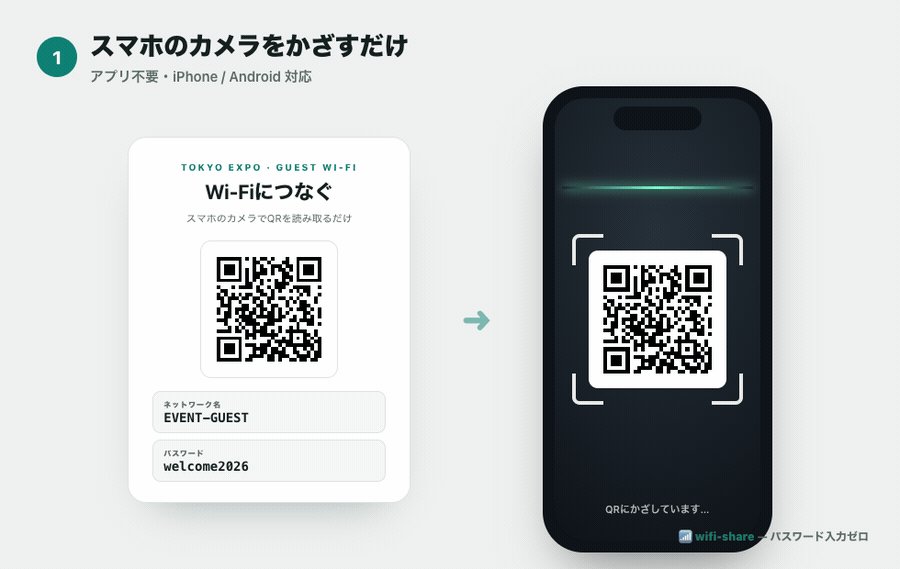
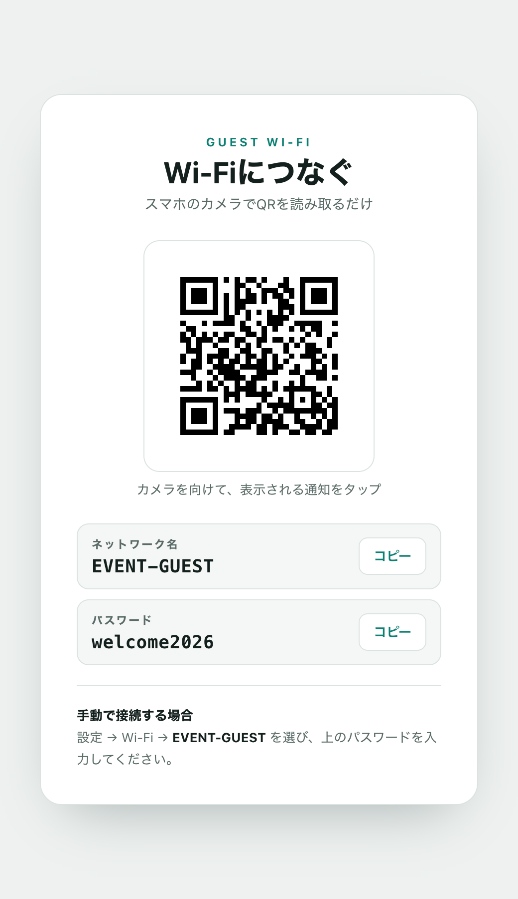

# 📶 wifi-share — 会場のWi‑Fiを「かざすだけ」でお渡しする

**日本語** | [English](README.en.md)

> 受付で「Wi‑Fiのパスワードは…」を、もう何十回も言わなくていい。
> 来場者がカメラをかざすだけで、その場でつながる。

**発酵プロデューサー / イベントディレクター 高須賀径太** が、現場でずっと感じていた小さなストレスを解くために作った、Wi‑Fi共有スキルです。
Wi‑Fiの「ネットワーク名」と「パスワード」を渡すだけで、**接続用QRポスターを自動生成 → 公開URL（`https://〇〇.vercel.app`）まで一気に仕上げます。**

<p align="center">
  
</p>
<p align="center"><sub>カメラをかざすだけ → 自動で検出 → タップ → 接続完了（パスワード入力ゼロ）</sub></p>

<p align="center">
  
  &nbsp;&nbsp;
  
</p>

---

## 🎪 こんな場面、ありませんか

イベント・セミナー・ポップアップ・撮影現場・コワーキング…人が集まる場所には、必ず「Wi‑Fiどうやってつなぐの？」が発生します。

- 受付スタッフが、来場者一人ひとりに口頭でパスワードを伝えている
- ホワイトボードに書いた長い英数字が、読み間違えられて「つながらない」と呼ばれる
- 紙に印刷した案内は、そもそも読まれない・見つけられない
- 登壇者・出展者・取材の方に、その都度スマホでパスワードを打ってもらう

**来場者の"最初の体験"が、パスワード入力のつまずきで始まってしまう。** これ、地味だけど体験全体の印象を下げます。

---

## ✅ これで解決します

来場者の動きは、たった2ステップ。

1. 会場に貼られたポスター（または共有URL）を**スマホのカメラでかざす**
2. 表示された通知を**タップ** → つながる

パスワードを1文字も入力させません。iPhone・Android どちらも標準対応の「Wi‑Fi QRコード」規格を使っているので、専用アプリも不要です。

---

## ✨ 特長

| | |
|---|---|
| 📷 **かざすだけ接続** | iPhone/Android標準対応のWi‑Fi QR。アプリ不要でワンタップ |
| 🔗 **URLで配れる** | 公開URL化するので、貼り出しても・チャットで送っても・スライドに出してもOK |
| 🖨️ **印刷にも対応** | QR単体のPNGも同時出力。受付やドアに貼るだけ |
| 🌐 **多言語スイッチャ** | 日本語 / English / 中文 / 한국어 / Español をタップで即切替。海外ゲストもそのまま |
| 🌗 **ライト/ダーク自動** | 会場のスクリーンやスマホの設定に合わせて見やすく表示 |
| ⌨️ **手入力の逃げ道つき** | ネットワーク名/パスワードのコピー機能＆手動接続手順も掲載 |
| 🛡️ **QR破損チェック内蔵** | 生成したQRを自己検証。現場で「読めない」を未然に防止 |

---

## 📸 実際の見た目

<p align="center">
  
</p>

- 上部にQR、その下に「ネットワーク名」「パスワード」をコピーボタン付きで表示
- 一番下に「手動で接続する場合」の手順
- 会場名を入れると、ヘッダーに「〇〇 · Guest Wi‑Fi」と表示されます

---

## 🚀 使い方（Claude Code スキル）

このリポジトリは [Claude Code](https://claude.com/claude-code) の**スキル**として動きます。

### 1. インストール

```bash
# スキルを自分の環境に配置
git clone https://github.com/tkaska-cell/wifi-share-skill.git
mkdir -p ~/.claude/skills
cp -R wifi-share-skill/skills/wifi-share ~/.claude/skills/
```

### 2. 呼び出す

Claude Code のプロンプトで:

```
/wifi-share TS-GUEST-A password123
```

または、会場からもらったWi‑Fi QR文字列をそのまま貼るだけ:

```
/wifi-share WIFI:S:TS-GUEST-A;T:WPA;P:password123;;
```

あとはClaudeが、
**QRポスター生成 → 表示チェック → Vercelで公開 → URLをお渡し** まで進めます。

> 💡 Vercelアカウント（無料でOK）と、初回のみ `vercel login` が必要です。
> 公開せず手元のQR画像・HTMLだけ欲しい場合も対応できます。

---

## 🛠️ Claude Codeを使わない人向け（スクリプト単体）

中身はシンプルなPythonスクリプトなので、単体でも使えます。

```bash
pip install "qrcode[pil]"

python3 skills/wifi-share/scripts/build_poster.py \
  --ssid "EVENT-GUEST" \
  --password "welcome2026" \
  --venue "あなたのイベント名" \
  --outdir ./public \
  --qr-png ./public/wifi_qr.png
```

`./public/index.html`（接続ポスター）と `./public/wifi_qr.png`（印刷用QR）が出力されます。
`index.html` をそのままブラウザで開けば、その場で使えます。公開したい場合は Vercel / Netlify / Cloudflare 等どこに置いてもOKです。

---

## 🎨 カスタマイズ

- `--venue "会場名"` … ヘッダーに会場名・イベント名を入れられます
- `--langs ja,en,zh,ko,es` … 言語スイッチャに並べる言語／`--lang ja` … 初期表示言語
- `--auth WPA|WEP|nopass` … 認証方式（既定は `WPA`。パスワード無しの公衆Wi‑Fiは `nopass`）
- デザイン（色・文言）は `build_poster.py` 内のHTMLテンプレート／`STRINGS` を編集すればブランド・他言語に合わせられます

<p align="center">
  
</p>
<p align="center"><sub>👆 上部のボタンで 日本語 / English / 中文 / 한국어 / Español を即切替（画像は한국어表示）</sub></p>

---

## 🔒 セキュリティ（標準で組み込み済み）

Wi‑Fiパスワードを公開URLに載せる性質上、安全に配れるよう最初から次の対策を入れています。

- **検索エンジンに載らない** … `noindex` メタ＋`X-Robots-Tag` ヘッダーで、パスワードがGoogle等にインデックスされません
- **推測されにくいURL** … 公開URLにランダムな文字列を付与（総当たりで見つかりにくい）
- **セキュリティヘッダー** … `nosniff` / `no-referrer` / `X-Frame-Options: DENY`（他サイトへの埋め込み＝クリックジャッキング防止）
- **すぐ消せる** … イベント終了後は1コマンドで削除（`vercel remove <name>`）。長期放置しない運用を推奨

### 使う側の注意

- Wi‑Fiパスワードは、**会場に掲示して来場者に配る前提の"ゲスト用"共有情報**として扱ってください
- **自宅・オフィスの常用Wi‑Fiや社内ネットワークの認証情報は、公開URLに載せないでください**（その場合は印刷用PNG／ローカルHTMLだけを使う運用が安全です）
- QRコードの中身はパスワードそのものです。QR画像をSNS等に貼る＝パスワードを貼るのと同じ、と意識して掲示範囲を決めてください
- このREADMEのスクリーンショットは、すべてダミーの認証情報です

---

## 🌾 作者

**高須賀径太（Keita Takasuka）** — 発酵プロデューサー / イベントディレクター / AIVEST CXO

AIマーケティング会社 **AIVEST** では **CXO（Chief Experience Officer / 最高体験責任者）** として、顧客体験の最大化に取り組んでいます。このスキルのように「小さな摩擦を消して体験をなめらかにする」ことが、私の一貫したテーマです。

一方で、日本の食卓に千年以上根づいてきた**発酵文化**を、もう一度おもしろく広げる活動もしています。
その拠点が、**米麹の専門店「FERMENT U」**。麹・甘酒・発酵ハーブソルトなど、"生きた発酵"を日常に届けるものづくりをしながら、全国で発酵イベント（醗酵EXPO 2025は来場2,000名超）をプロデュースしています。

このスキルも、そんな現場から生まれました。イベント会場で数えきれないほど繰り返してきた「Wi‑Fiのご案内」を、来場者体験を落とさない形にしたくて。
イベンター・コンテンツホルダーの皆さんの現場が、ほんの少し軽くなればうれしいです。

発酵のこと、ものづくりのこと、イベントのこと — よかったらのぞいてみてください🌾

- 🌐 **FERMENT U 公式サイト**: https://ferment-u.com
- 📷 **Instagram（発酵の日常を毎日更新）**: [@ferment.u](https://www.instagram.com/ferment.u/)

改善アイデア・不具合報告は Issue / Pull Request でお気軽にどうぞ。

## 📄 ライセンス

MIT License — 商用・非商用問わず自由にお使いください。
